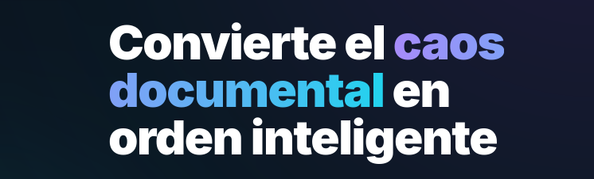

# MagicDocu
Gestor inteligente de archivos con funcionalidades para interrelacionarlos y contextualizarlos en diferentes aspectos.



## Objetivo
El objetivo de este proyecto es facilitar la navegación entre documentos de empresa en grandes cantidades, de diferentes tipos, formatos y funciones. Centrado en la búsqueda dinámica e inteligente, esta plataforma permite al usuario gestionar sus documentos de una forma más ordenada y coherente, independientemente de las diferencias entre éstos.


## Funcionalidades
- Subida y eliminación de archivos.
- Extracción de palabras clave de cada documento.
- Búsqueda inteligente mediante LLMs con embeddings.
- Visualización de archivos y de sus metadatos.
- Sistema de etiquetas personalizadas.
- Búsquedas personalizadas mediante diferentes parámetros.
- Chatbot integrado con información sobre los ficheros, para contextualizar de forma más sencilla.


## Stack
- **Front-end**: Python (con [Django](https://www.djangoproject.com/)).
- **Back-end**: Base de datos [PostgreSQL](https://www.postgresql.org/), conectada con el ORM de Django. Sistema vectorial de embeddings soportado mediante [pgvector](https://github.com/pgvector/pgvector).
- **Despliegue**: [Docker](https://www.docker.com/).

Este proyecto da uso a dos LLMs para la implementación de algunos sistemas inteligentes.


### Modelos utilizados
- [**nomic-embed-text**](https://ollama.com/library/nomic-embed-text): Para la obtención de los keywords de los archivos y la interrelación entre ellos con embeddings.
- [**llama**](https://ollama.com/library/llama3): Para la implementación del chatbot. 

### Implementación de modelos
Para la descarga y ejecución de los modelos, este proyecto utiliza [Ollama](https://ollama.com/). Para la optimización y gestión de memoria de los modelos se ha utilizado [Redis](https://redis.io/). 

## Build
Para ejecutar la plataforma, primero clona el respositorio:

```
$ git clone https://github.com/Sprinter05/magicdocu.git
```

Navega al directorio raíz del repositorio y ejecuta el comando `docker/build.sh` (asumiendo que Docker está instalado en la máquina):

```
$ cd magicdocu
$ docker/build.sh
```

Una vez construidas las imágenes, navega al directorio `docker/` y compón el Docker:

```
$ docker compose up -d
```

Durante la primera inicialización, es normal que la carga sea larga. Esto se debe a la descarga de los modelos.

Este comando servirá la base de datos, los modelos de Ollama y la misma plataforma. La base de datos estará abierta en el puerto ` 5432`, Ollama en el puerto `11431`, Redis en el puerto `6379` y Django en el puerto `8000`, todos en `localhost`. Puedes conectarte a la página una vez compuesto el Docker mediante el siguiente enlace: http://127.0.0.1:8000.

Una vez termines tu sesión, es buena práctica finalizar la composición del Docker:

```
$ docker compose down
```

Si quieres eliminar los volúmenes del sistema, añade la opción `-v` al comando anterior:

```
$ docker compose down -v
```

Este comando eliminará todos los datos generados por el programa, incluidos los modelos.

## Dependencias
Consulta `requirements.txt` para obtener informacíon sobre los requerimientos del programa.

## Codeowners
Este proyecto fue realizado durante el hackathon [HackUDC 2026](https://live.hackudc.gpul.org/), en la [Universidade da Coruña](https://www.udc.es/), por el siguiente equipo de desarrolladores:

- [yagueto](https://github.com/yagueto)
- [sprinter05](https://github.com/sprinter05)
- [markelmencia](https://github.com/markelmencia)
- [sergitxin22](https://github.com/Sergitxin22)

Más información sobre contribuciones individuales en `CONTRIBUTORS.md`.

## Licencia
Este repositorio sigue la [GNU General Public License](https://www.gnu.org/licenses/gpl-3.0.html) (GPLv3). Se permite la copia y distribución de copias literales de esta licencia, pero no se permite su modificación. Para más información, consulta `LICENSE`.
